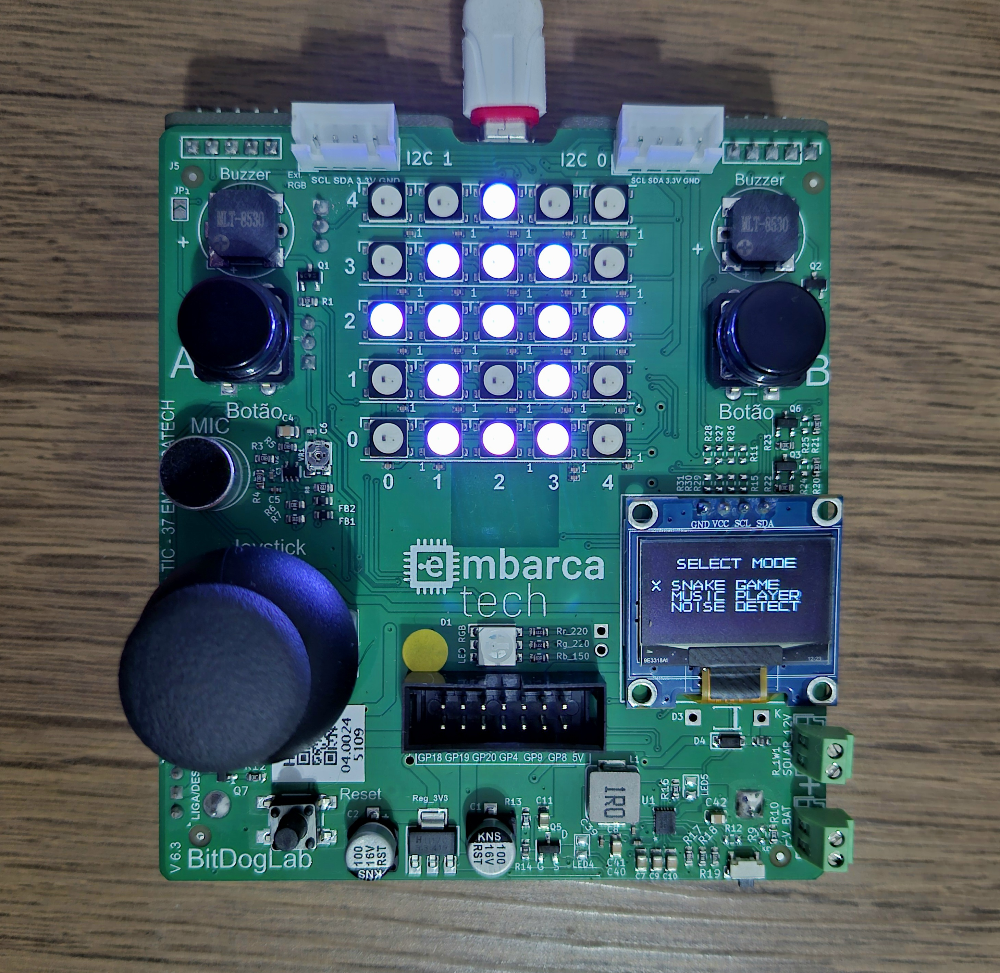

# Unidade multimídia para uso doméstico

Este projeto foi desenvolvido utilizando a placa BitDogLab (Raspberry Pi Pico W) e implementa um sistema de múltiplas funcionalidades, incluindo um jogo da cobrinha, um reprodutor de músicas e um sistema de detecção de sons. A interação é feita por meio de um display OLED, LEDs NeoPixel e botões físicos.

<!--   -->


[](menu.jpg)

## Funcionalidades

1. **Menu Principal**:
   - O sistema exibe um menu onde o usuário pode selecionar entre três opções:
     - **Jogo da Cobrinha**: Um jogo simples de cobrinha controlado por um joystick.
     - **Reprodutor de Música**: Permite a reprodução de músicas, com controle de pausa e reprodução.
     - **Detecção de Sons**: Detecta sons, como aplausos ou ruídos altos, e executa ações específicas, como ativar um alarme ou alternar LEDs.

2. **Jogo da Cobrinha**:
   - O jogo da cobrinha é controlado por um joystick e os LEDs NeoPixel representam a cobrinha no display.
   - O jogador pode iniciar o jogo, mover a cobrinha e coletar maçãs.
   - O jogo termina quando a cobrinha colide consigo mesma.

3. **Reprodutor de Música**:
   - O reprodutor de músicas permite a reprodução de arquivos de música armazenados no dispositivo.
   - O usuário pode pausar, retomar e interromper a reprodução de músicas usando os botões A e B.

4. **Detecção de Sons**:
   - O sistema escuta e detecta sons, como aplausos e ruídos altos.
   - Quando um som alto é detectado, um alarme é ativado.
   - Quando um duplo aplauso é detectado, os LEDs alternam de estado.

## Requisitos

- **Hardware**:
  - BitDogLab (Raspberry Pi Pico W)
  - Display OLED
  - LEDs NeoPixel
  - Joystick
  - Botões A e B
  - Microfone (para detecção de sons)

- **Software**:
  - IDE de sua preferência (como o Visual Studio Code ou a Thonny)
  - SDK da Raspberry Pi Pico (C)

## Instalação

1. Clone este repositório para o seu ambiente de desenvolvimento:
   ```bash
   git clone https://github.com/seu-usuario/seu-repositorio.git
   ```

2. Configure a IDE com o SDK da Raspberry Pi Pico W (1.5.1).

3. Compile e faça o upload do código para o Raspberry Pi Pico W.

4. Conecte os periféricos conforme descrito na documentação.

## Como Usar

1. Ao ligar o sistema, o menu principal será exibido no display OLED. Use o botão A para alternar entre as opções e o botão B para confirmar a seleção.

2. **Jogo da Cobrinha**:
   - Use o joystick para controlar a cobrinha.
   - A partida termina quando a cobrinha colide consigo mesma.

3. **Reprodutor de Música**:
   - O reprodutor de música começa automaticamente. Use o botão A para alternar entre músicas, e o botão B para pausar ou retomar a música.

4. **Detecção de Sons**:
   - O sistema começa a escutar sons assim que você selecionar a opção. Um som alto ativa um alarme, e um duplo aplauso alterna os LEDs.

## Estrutura do Código

- **main.c**: Código completo e principal que inicializa o sistema, gerencia estados e executa as três funcionalidades.
- **game.c**: Código modular para teste do jogo da cobrinha, incluindo movimentação e controle de estado.
- **music.c**: Código modular para teste do reprodutor de músicas, incluindo reprodução, pausa e troca de músicas.
- **noise.c**: Código modular para teste da detecção de sons e execução das ações correspondentes (alarme e LEDs).

## Testes Realizados

Durante o desenvolvimento, diversos testes foram realizados para garantir que cada funcionalidade estivesse operando corretamente:

- Testes de interação com os botões A e B.
- Testes de desempenho do jogo da cobrinha, garantindo a atualização correta da posição da cobrinha e a colisão com objetos.
- Testes de sensibilidade do sistema de detecção de sons, ajustando a resposta a aplausos e ruídos.
- Validação da reprodução e controle das músicas.

## Possíveis Melhorias

Embora o sistema esteja funcional, algumas pequenas melhorias podem ser feitas:

- Ajustar a sensibilidade da detecção de aplausos e barulhos intensos.
- Corrigir a imprecisão do jogo da cobrinha, que ocasionalmente exibe uma segunda maçã brevemente.
- Melhorar o controle de pausa/play no reprodutor de música para lidar com interrupções de notas.

## Contribuições

Sinta-se à vontade para contribuir com melhorias ou correções! Abra uma issue ou envie um pull request com sugestões.

## Licença

Este projeto é licenciado sob a Licença MIT - veja o arquivo [LICENSE](LICENSE) para mais detalhes.
